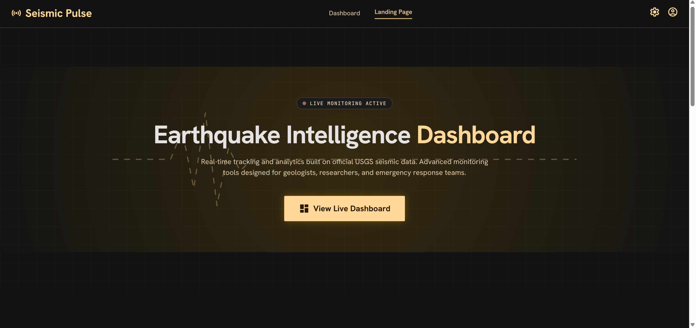
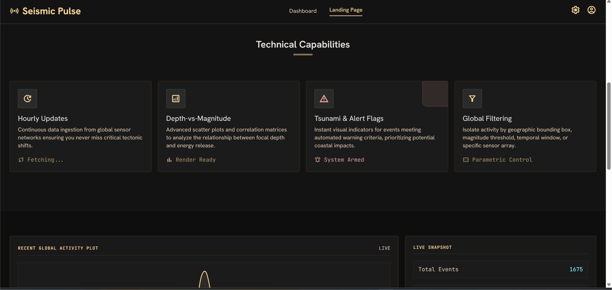
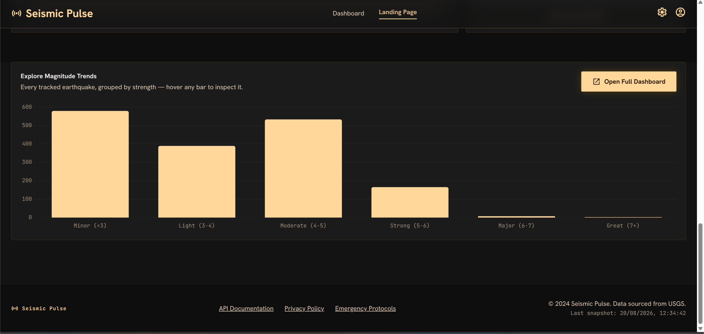
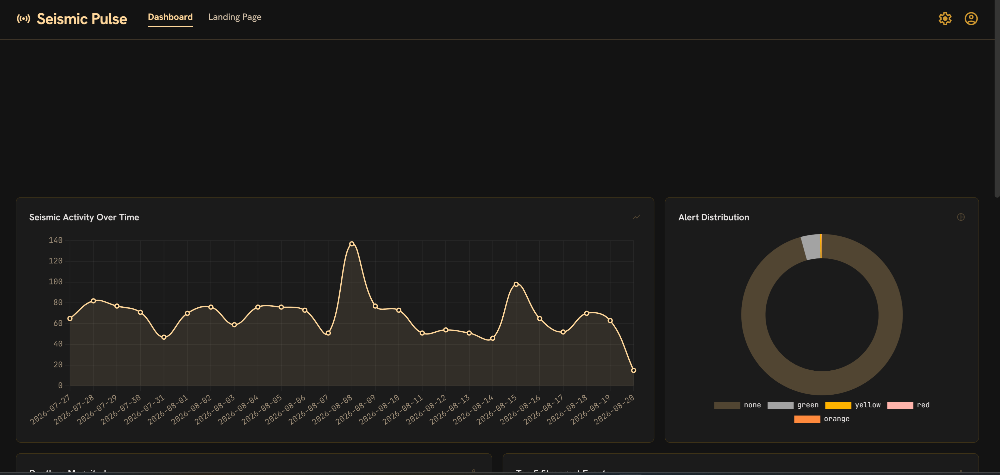
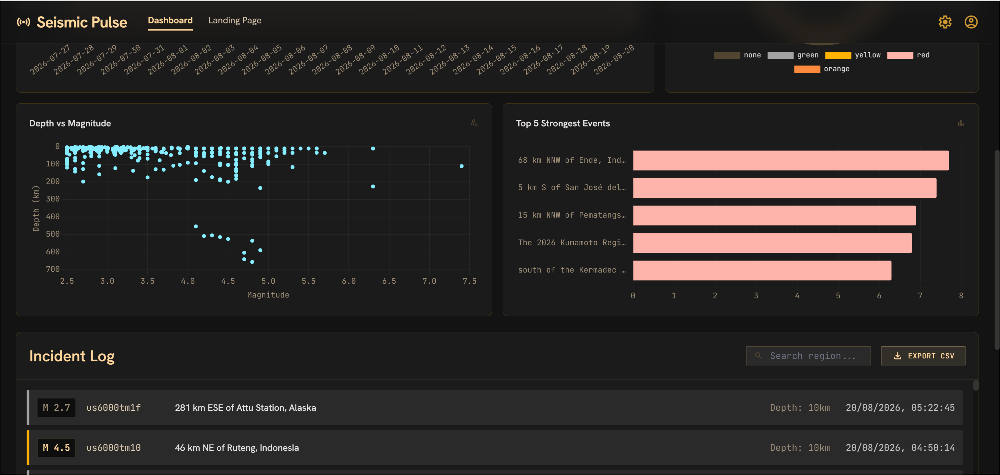
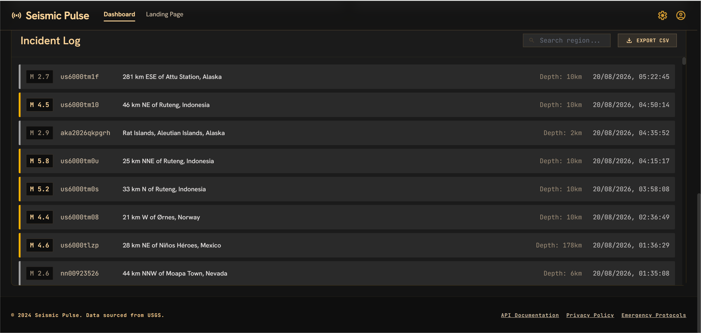

# Seismic Pulse — Earthquake Intelligence Dashboard

**A real-time earthquake tracker and analytics dashboard, built on live data from the USGS Earthquake Hazards Program.**

Fetches real seismic event data from USGS's public API, cleans and stores it in PostgreSQL, and serves it through a Flask API to an interactive dashboard — with filtering by magnitude, alert level, and region, plus visual analytics including a depth-vs-magnitude scatter plot. A background scheduler keeps the data fresh every hour, since seismic activity doesn't wait for a daily refresh.

## Features

- **Automated hourly pipeline** — fetches, cleans, and stores earthquake data from the USGS API on a 1-hour schedule
- **Interactive dashboard** — filter by minimum magnitude, USGS alert level, tsunami flag, or search any region by name
- **Visualizations** — magnitude distribution, alert-level breakdown, earthquakes over time, and a depth-vs-magnitude scatter plot, all built with Chart.js
- **CSV export** — download the currently filtered set of earthquakes
- **REST API** — a small Flask backend exposing earthquake data and summary statistics as JSON
- **Landing page** — a proper entry page describing the project, with a "View Live Dashboard" button

## Tech stack

| Layer      | Technology |
|------------|------------|
| Data pipeline | Python, Requests, Pandas |
| Backend    | Flask, Flask-CORS |
| Database   | PostgreSQL (psycopg2) |
| Scheduling | `schedule` |
| Frontend   | HTML, Tailwind CSS (CDN), vanilla JavaScript, Chart.js |

The frontend UI was designed in Google Stitch ("mission control" glassmorphism theme — deep charcoal surfaces, amber accent, JetBrains Mono for all data readouts) and wired up to the live backend: every number, chart, and log entry you see is real data, not the original design mockup's placeholder numbers.

## Screenshots










## Project structure

```
earthquake_dashboard/
  src/
    config.py        Loads DB credentials + fetch settings from .env
    fetch_data.py     Pulls earthquake data from the USGS API
    store_data.py      Creates the table and stores fetched events
    scheduler.py        Runs store_data on an hourly loop
    api.py                Flask API serving the dashboard
  dashboard/
    index.html            Landing page (Stitch-designed)
    dashboard.html          The live dashboard (Stitch-designed)
    script.js               Fetches from the API, renders charts + incident log
  requirements.txt
  .env.example
```

## How to run it

You'll need **Python 3.11 or 3.12** (very new Python versions like 3.14 don't yet have prebuilt `psycopg2-binary` wheels — use a virtual environment on 3.11/3.12 if that's an issue) and **PostgreSQL** installed.

**1. Install dependencies**
```bash
cd earthquake_dashboard
pip install -r requirements.txt
```
*(Recommended: create a virtual environment first — `python -m venv venv`, then activate it before installing.)*

**2. Set up your database config**
```bash
cp .env.example .env
```
Open `.env` and fill in your PostgreSQL password.

**3. Create the database**
```sql
CREATE DATABASE earthquake_tracker;
```

**4. Fetch and store earthquake data**
```bash
cd src
python store_data.py
```
By default this fetches the last 30 days of earthquakes with magnitude 2.5+. You can adjust `EARTHQUAKE_DAYS_BACK` and `EARTHQUAKE_MIN_MAGNITUDE` in `.env`.

**5. Start the API**
```bash
python api.py
```
Leave this running — you should see `API running at: http://localhost:5000`.

**6. Open the dashboard**

Open `dashboard/index.html` in your browser — this is the landing page. Click **"View Live Dashboard"** to see the live data.

**7. (Optional) Run the scheduler for automatic hourly updates**
```bash
cd src
python scheduler.py
```

## Architecture notes

- **Idempotent storage** — `store_earthquakes()` uses `ON CONFLICT (earthquake_id) DO NOTHING`, so re-running the pipeline never creates duplicates, even though the same earthquake will appear in every fetch until it ages out of the 30-day window.
- **Hourly, not daily, scheduling** — unlike a slower-moving dataset, earthquakes happen constantly, so the scheduler here refreshes every hour instead of once a day.
- **Real alert semantics** — the alert-level colors (green/yellow/orange/red) match USGS's own PAGER alert system, not arbitrary colors — someone familiar with the data will recognize them immediately.
- **Config over hardcoding** — database credentials live in `.env` (gitignored) via `config.py`, consistent with my other projects.

## Before you push or deploy

- Never commit a real `.env` file — it's already excluded via `.gitignore`.
- `scheduler.log` and `__pycache__/` are also gitignored.

## Author

Built by [Tanisha Suman](https://github.com/Tanisha2705).
